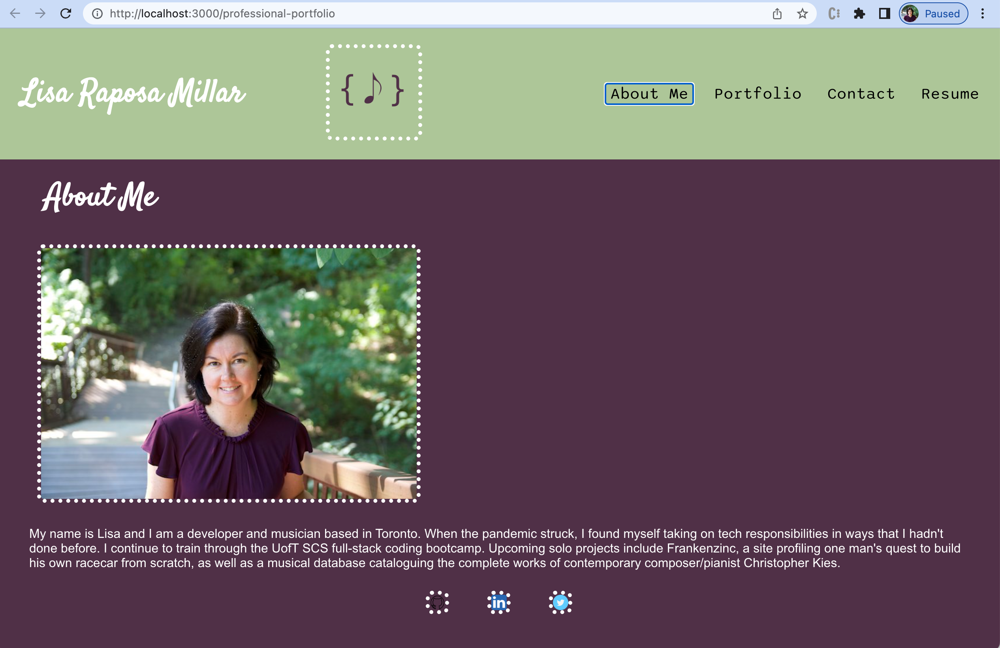

  # Professional Portfolio
  ###  

  ## Table of Contents
  - [Description](#description)
  - [Installation](#installation)
  - [Usage](#usage)
  - [Contributing](#contributing)
  - [Tests](#tests)
  - [Questions](#questions)
  - [License](#license)

  ## Description 
  This profile site created with React contains my developer bio, work, and social links. 
  <a href="https://raposamillar.github.io/professional-portfolio/">Link to deployed application.</a>
  
  ## Installation 
   1. npm install 2. npx create-react-app
  
  ## Usage
  npm start

  ## Contributing 
  Developers who have ideas for improvement may fork this project and submit pull requests for review.

  ## Tests
  n/a

  ## Questions 
  Please feel free to reach out via either of the links below. 
  GitHub: <a href="https://github.com/raposamillar/">raposamillar</a> 
  Email: lisa.raposamillar@gmail.com

  ## License
  ### This application is covered under the [GPL v3.0](https://choosealicense.com/licenses/gpl-3.0/) license.

